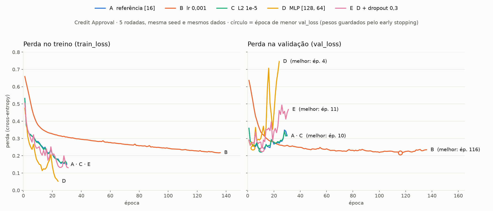

# Treinamento observável — MLP para aprovação de crédito com MLflow

**IA 2026/2 — Sistemas de Informação / UNITINS — Avaliação A1**
**Aluno:** Rafael Silva Diniz
**Vídeo:** _(link do YouTube)_

Reorganização do script da aula `mlp_torch_avaliacao.py` (MLP em PyTorch) como um pipeline de
**treino → validação → teste**, configurável por YAML e rastreado no **MLflow** (parâmetros, métricas por
época, artefatos, modelo e trace). Dataset: **Credit Approval** (UCI, id 27) — 690 pedidos de cartão de
crédito, 15 atributos anonimizados, alvo `+` aprovado / `-` rejeitado.

## Como rodar

```bash
git clone https://github.com/rafaelsdiniz/credit-approval-mlflow.git
cd credit-approval-mlflow

# Linux / macOS                      # Windows (PowerShell)
bash setup.sh                        # python -m venv .venv
source .venv/bin/activate            # .\.venv\Scripts\Activate.ps1
                                     # pip install torch --index-url https://download.pytorch.org/whl/cpu
                                     # pip install -r requirements.txt

bash run_all.sh                      # .\run_all.ps1   -> executa as 5 rodadas (~1 min na CPU)
mlflow ui --backend-store-uri sqlite:///mlflow.db     # abre http://127.0.0.1:5000
```

Uma rodada por vez: `python -m src.train --config configs/run_a_referencia.yaml`.
Qualquer chave do YAML pode ser trocada sem editar o arquivo:
`python -m src.train --config configs/run_a_referencia.yaml --set treino.lr=0.005 --set experimento.run_name=A_lr_0005`.
Tabela comparativa no terminal: `python -m src.comparar`.

## Estrutura

| Arquivo | O que faz |
|---|---|
| `configs/run_*.yaml` | Uma rodada por arquivo: nome, pergunta, **hipótese**, seed, split, arquitetura, lr, L2, batch, épocas, paciência |
| `src/data.py` | Carrega o dataset (UCI → cópia local `data/crx.data`), converte o alvo para 0/1, split estratificado 70/15/15 |
| `src/features.py` | `ColumnTransformer`: numéricos → mediana + `StandardScaler`; categóricos → moda + one-hot. **Ajustado só no treino** |
| `src/model.py` | Classe `MLP` (`Linear → ReLU → Linear`, camadas ocultas vindas da config) |
| `src/train.py` | Pipeline: prepara → treina (mini-batch, early stopping) → valida e testa, registrando tudo no MLflow |
| `src/comparar.py` | Imprime a tabela comparativa das rodadas |

## As rodadas

Mesma arquitetura, mesmo split, mesma seed (42) e mesmas épocas nas rodadas A, B e C; D e E são a
investigação extra com uma MLP maior. Toda rodada registra sua **pergunta** e **hipótese** como tags.

| Rodada | O que muda | Hipótese (resumo) |
|---|---|---|
| **A** referência | MLP [16], lr 0,01, L2 0 | aprende rápido e começa a sobreajustar depois de poucas épocas |
| **B** taxa menor | lr 0,001 | curva mais suave, converge mais devagar |
| **C** com L2 | weight_decay 1e-5 | L2 deve segurar a subida da val_loss; se for fraco demais, igual a A |
| **D** MLP grande | [128, 64] | com 18x mais parâmetros, deve decorar o treino |
| **E** D + dropout 0,3 | nova run após o diagnóstico de D | dropout adia e suaviza o overfitting |

## O que cada rodada registra no MLflow

- **Tags**: pergunta, hipótese, dataset, origem dos dados, device.
- **Parâmetros**: toda a config (`modelo.camadas_ocultas`, `treino.lr`, `treino.weight_decay`, `seed`, `dados.frac_val`...) e `n_train`, `n_val`, `n_test`, `n_features`.
- **Métricas por época**: `train_loss`, `val_loss`, `train_accuracy`, `val_accuracy`.
- **Métricas finais**: validação (`val_f1`, `val_roc_auc`, ...), teste (`test_accuracy`, `test_f1`, `test_roc_auc`, ...), `melhor_epoca`, `epocas_executadas`.
- **Artefatos**: `curvas_treinamento.png`, `matriz_confusao_teste.png`, `classification_report_teste.txt`, `config_usada.yaml`, `divisao_dados.csv` (índice e conjunto de cada linha), `resumo_preprocessamento.txt`, `preprocessador.joblib` e o modelo (`mlflow.pytorch.log_model`).
- **Trace**: spans `preparar_dados`, `treinar` e `validar_e_testar`, com entradas, saídas, duração e erro.

O conjunto de teste é usado **uma única vez**, no final, com os pesos da melhor época.

## Resultados (seed 42, torch 2.14.1 CPU)

Números reais, copiados do MLflow (`python -m src.comparar`). Negrito = melhor de cada coluna.

| Rodada | Config | Melhor época | val_f1 | val_roc_auc | test_accuracy | test_f1 | test_roc_auc |
|---|---|---|---|---|---|---|---|
| **A** referência | [16], lr 0,01 | 10 | 0,9013 | **0,9722** | **0,8750** | **0,8736** | 0,9520 |
| **B** lr menor | [16], lr 0,001 | 116 | 0,9018 | 0,9714 | 0,8462 | 0,8447 | 0,9472 |
| **C** com L2 | [16], L2 1e-5 | 10 | 0,9013 | 0,9703 | 0,8654 | 0,8636 | 0,9475 |
| **D** MLP grande | [128, 64] | 4 | 0,9214 | 0,9641 | 0,8365 | 0,8362 | **0,9543** |
| **E** D + dropout | [128, 64], dropout 0,3 | 11 | **0,9308** | 0,9695 | 0,8654 | 0,8641 | 0,9442 |



*Curvas por época, lidas do `mlflow.db`. O círculo marca a época de menor `val_loss`, cujos pesos o early
stopping guardou. A e C ficam uma em cima da outra; D dispara depois da época 4; E sobe mais devagar que D.*

### Hipótese × resultado (curvas registradas no MLflow)

- **A** — confirmada. A `val_loss` mínima vem na época 10 (0,233) e depois sobe até 0,315 na época 30,
  enquanto a `train_loss` cai para 0,149: overfitting leve, controlado pelo early stopping.
- **B** — confirmada em parte. A curva é mais suave e a `val_loss` mínima é um pouco menor que a de A
  (0,217 contra 0,233), mas precisou de 116 épocas e no teste ficou pior (F1 0,845).
- **C** — confirmada a parte "fraco demais". Com L2 de 1e-5 a curva é praticamente idêntica à de A:
  mesma melhor época (10) e mesma `val_loss` mínima (0,233).
- **D** — confirmada. Melhor época já na 4; daí em diante a `val_loss` dispara de 0,245 para 0,746
  enquanto a `train_loss` vai a 0,05 e a acurácia de treino chega a 98 % contra 82 % na validação.
  Tem o maior ROC-AUC de teste, mas a pior F1 e acurácia: a capacidade extra não vira classificação melhor.
- **E** — confirmada. O dropout adia a melhor época (4 → 11) e a `val_loss` sobe mais devagar
  (0,47 na última época, contra 0,75 em D). Melhora o teste em relação a D (F1 0,836 → 0,864), mas não supera A.

### Modelo escolhido: rodada A

A escolha foi feita **na validação, antes de olhar o teste**. A, B e C empatam em `val_f1` (0,901, diferença
de 1 amostra em 103); E tem `val_f1` maior (0,931, 3 amostras a mais), mas A tem a maior `val_roc_auc`
(0,972), a curva mais estável, chega lá em 10 épocas e tem 18x menos parâmetros (786 contra 14 402).
O teste, usado uma única vez, confirmou: A tem a maior acurácia (0,875) e F1 (0,874) entre as cinco rodadas.

**Ressalva:** validação e teste têm ~100 amostras cada, logo 1 amostra ≈ 1 ponto percentual. Diferenças de
poucos pontos são inconclusivas; a decisão se apoia nas curvas e no histórico, não só no número final.

**Reprodutibilidade:** com a mesma seed, rodar de novo dá exatamente os mesmos números. A rodada E (dropout)
pode variar entre **versões** do PyTorch, porque o sorteio dos neurônios desligados muda de uma versão para outra.

## Correção em relação ao script original

No script da aula o `StandardScaler` é ajustado com **todos** os dados antes do `train_test_split`, o que
vaza informação de validação/teste para o treino. Aqui o split vem primeiro e o pré-processador é ajustado
**somente no treino** (`fit_transform(X_train)`) e apenas aplicado aos demais conjuntos (`src/features.py`).
Outras mudanças: mini-batches com `DataLoader`, early stopping pela `val_loss` guardando os pesos da melhor
época, seeds fixas, split estratificado e figuras salvas como artefatos em vez de `plt.show()`.
O que não mudou: `nn.Module`, `CrossEntropyLoss`, `Adam`, loop manual de treino/validação e as métricas.

## Referências

- Script original: `sousamaf/AI-Lab` — `algorithms/neural_networks/mlp/mlp_torch_avaliacao.py`
- Dataset: Quinlan, J. R. *Credit Approval*. UCI Machine Learning Repository, id 27.
- MLflow Tracking / Tracing — <https://mlflow.org/docs/latest/>
